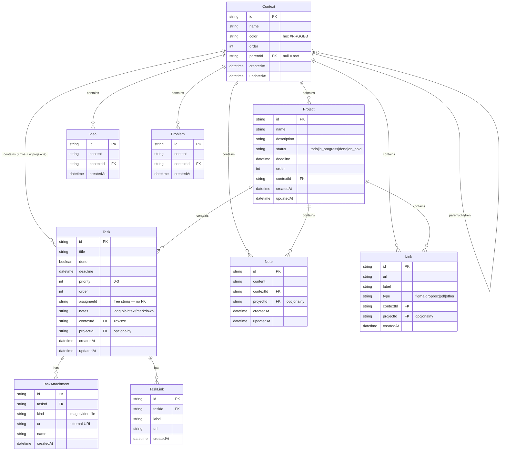

# DOMAIN_MODEL.md — model danych

## Zasada nadrzędna

Schema musi być Postgres-compatible od dnia pierwszego. Używamy wyłącznie typów zgodnych z oboma SQLite i Postgres: `String`, `Int`, `Boolean`, `DateTime`, `Float`. Żadnego Postgres-only (enumy, array, jsonb). **Obecnie działa na Postgres (Neon w produkcji, Postgres lokalnie).**

---

## Diagram relacji (Mermaid)



---

## Pełna definicja — `prisma/schema.prisma`

```prisma
// Wyczesany HQ — schema bazy danych.
// WAZNE: schema musi byc Postgres-compatible od dnia pierwszego.
// Migracja SQLite -> Postgres = zmiana tylko provider'a ponizej.
// Uzywamy tylko: String, Int, Boolean, DateTime, Float.

generator client {
  provider = "prisma-client"
  output   = "../lib/generated/prisma"
}

datasource db {
  provider = "postgresql"
}

// =====================================================
// Context — kregoslup aplikacji.
// Hierarchia o dowolnej glebokosci (parent/children).
// =====================================================
model Context {
  id        String   @id @default(cuid())
  name      String
  color     String   // hex, np. #5B3DF5
  order     Int      @default(0)
  createdAt DateTime @default(now())
  updatedAt DateTime @updatedAt

  // Self-relation: parent + children
  parentId String?
  parent   Context?  @relation("ContextHierarchy", fields: [parentId], references: [id])
  children Context[] @relation("ContextHierarchy")

  // Zasoby zyjace w kontekscie
  projects Project[]
  tasks    Task[]    // luzne taski (bez projectId)
  ideas    Idea[]
  problems Problem[]
  notes    Note[]
  links    Link[]
}

// =====================================================
// Project — rozpisana inicjatywa wewnatrz kontekstu.
// =====================================================
model Project {
  id          String    @id @default(cuid())
  name        String
  description String?
  status      String    @default("todo") // todo | in_progress | done | on_hold
  deadline    DateTime?
  order       Int       @default(0)
  createdAt   DateTime  @default(now())
  updatedAt   DateTime  @updatedAt

  contextId String
  context   Context @relation(fields: [contextId], references: [id])

  // Wlasne zasoby projektu
  tasks Task[]
  notes Note[]
  links Link[]
}

// =====================================================
// Task — konkretne zadanie. Moze byc luzne (w kontekscie)
// albo czesc projektu.
// =====================================================
model Task {
  id         String    @id @default(cuid())
  title      String
  done       Boolean   @default(false)
  deadline   DateTime?
  priority   Int       @default(0) // 0 = brak, 1 = low, 2 = medium, 3 = high
  order      Int       @default(0)
  assigneeId String?   // na razie string (bez FK) — user system w Etapie 8
  notes      String?   // dlugie notatki, plaintext/markdown
  createdAt  DateTime  @default(now())
  updatedAt  DateTime  @updatedAt

  // Task moze byc luzny (tylko contextId) albo czesc projektu (oba ID)
  contextId String
  context   Context @relation(fields: [contextId], references: [id])

  projectId String?
  project   Project? @relation(fields: [projectId], references: [id])

  // Wlasne zasoby taska
  attachments TaskAttachment[]
  links       TaskLink[]
}

// =====================================================
// TaskAttachment — pliki i zdjecia doklejone do taska.
// Na razie url zewnetrzny, upload zrobimy pozniej.
// =====================================================
model TaskAttachment {
  id        String   @id @default(cuid())
  taskId    String
  task      Task     @relation(fields: [taskId], references: [id], onDelete: Cascade)
  kind      String   // "image" | "video" | "file"
  url       String
  name      String
  createdAt DateTime @default(now())
}

// =====================================================
// TaskLink — linki per task (odrebne od Link na kontekscie/projekcie).
// =====================================================
model TaskLink {
  id        String   @id @default(cuid())
  taskId    String
  task      Task     @relation(fields: [taskId], references: [id], onDelete: Cascade)
  label     String
  url       String
  createdAt DateTime @default(now())
}

// =====================================================
// Idea — surowiec. Pomysl ktory czeka na decyzje.
// =====================================================
model Idea {
  id        String   @id @default(cuid())
  content   String
  createdAt DateTime @default(now())

  contextId String
  context   Context @relation(fields: [contextId], references: [id])
}

// =====================================================
// Problem — surowiec. Bloker albo trudnosc do przemyslenia.
// =====================================================
model Problem {
  id        String   @id @default(cuid())
  content   String
  createdAt DateTime @default(now())

  contextId String
  context   Context @relation(fields: [contextId], references: [id])
}

// =====================================================
// Note — wolnotekstowa notatka.
// Moze byc w kontekscie albo w projekcie.
// =====================================================
model Note {
  id        String   @id @default(cuid())
  content   String
  createdAt DateTime @default(now())
  updatedAt DateTime @updatedAt

  contextId String
  context   Context @relation(fields: [contextId], references: [id])

  projectId String?
  project   Project? @relation(fields: [projectId], references: [id])
}

// =====================================================
// Link — URL z etykieta i typem (figma/dropbox/pdf/inne).
// Moze byc w kontekscie albo w projekcie.
// =====================================================
model Link {
  id        String   @id @default(cuid())
  url       String
  label     String
  type      String   @default("other") // figma | dropbox | pdf | other
  createdAt DateTime @default(now())

  contextId String
  context   Context @relation(fields: [contextId], references: [id])

  projectId String?
  project   Project? @relation(fields: [projectId], references: [id])
}
```

---

## Typy warstwy aplikacji — `lib/queries/dashboard.ts`

```ts
export type OriginContext = {
  id: string;
  name: string;
  color: string;
};

export type TaskAttachmentDTO = {
  id: string;
  kind: string;
  url: string;
  name: string;
};

export type TaskLinkDTO = {
  id: string;
  label: string;
  url: string;
};

export type DashboardTask = {
  id: string;
  title: string;
  done: boolean;
  deadline: Date | null;
  priority: number;
  order: number;
  assigneeId: string | null;
  notes: string | null;
  projectId: string | null;
  createdAt: Date;
  context: OriginContext;
  attachments: TaskAttachmentDTO[];
  links: TaskLinkDTO[];
};

export type DashboardProject = {
  id: string;
  name: string;
  description: string | null;
  status: string;
  deadline: Date | null;
  order: number;
  createdAt: Date;
  context: OriginContext;
  tasks: DashboardTask[]; // pelne taski projektu, posortowane po order
  taskTotal: number;
  taskDone: number;
};

export type DashboardItem = {
  id: string;
  content: string;
  createdAt: Date;
  context: OriginContext;
};

export type DashboardData = {
  // Aktualny kontekst (null dla globalnego dashboardu)
  current: {
    id: string;
    name: string;
    color: string;
    breadcrumb: Array<{ id: string; name: string; color: string }>;
  } | null;
  projects: DashboardProject[];
  looseTasks: DashboardTask[]; // niezakonczone, projectId = null
  doneTasks: DashboardTask[];  // historia — zakonczone luzne taski
  ideas: DashboardItem[];
  problems: DashboardItem[];
};
```

## Typy warstwy aplikacji — `lib/queries/contexts.ts`

```ts
export type ContextNode = {
  id: string;
  name: string;
  color: string;
  parentId: string | null;
  order: number;
  children: ContextNode[];
  // Liczby zagregowane „w dol" (ten kontekst + wszystkie dzieci, wnuki...)
  projectCount: number;
  taskCount: number;
  // Liczby wlasne (tylko ten kontekst, bez dzieci) — przydatne przy usuwaniu
  ownProjectCount: number;
  ownTaskCount: number;
  ownIdeaCount: number;
  ownProblemCount: number;
  ownNoteCount: number;
  ownLinkCount: number;
};
```

---

## Paleta kontekstów — `lib/colors.ts`

```ts
export const CONTEXT_PALETTE: ColorSwatch[] = [
  { hex: "#5B3DF5", name: "Fioletowy",    soft: "#E8E2FE" },
  { hex: "#DC2626", name: "Czerwony",     soft: "#FCE4E4" },
  { hex: "#F97316", name: "Pomaranczowy", soft: "#FEE7D0" },
  { hex: "#FF6B4A", name: "Koralowy",     soft: "#FFE1D8" },
  { hex: "#64748B", name: "Szary",        soft: "#E6E9ED" },
  { hex: "#16A34A", name: "Zielony",      soft: "#DDF3E2" },
  { hex: "#0D9488", name: "Turkusowy",    soft: "#D5EEEA" },
  { hex: "#DB2777", name: "Rozowy",       soft: "#FBDDEB" },
  { hex: "#2563EB", name: "Niebieski",    soft: "#DCE7FB" },
  { hex: "#CA8A04", name: "Zolty",        soft: "#FBEFCF" },
];
```

Kontekst ma zapisany hex. Dziedziczenie koloru: dziecko dziedziczy po rodzicu (wizualnie — w UI), ale pole `color` jest zapisane osobno per kontekst (można nadpisać w settings).

---

## Startowa hierarchia (seed)

Z `prisma/seed.ts`:

```
Salony (#5B3DF5 fioletowy)
├── WFM
│   ├── Legnicka
│   ├── Łódzka
│   └── Zakładowa
├── Luxfera
└── Głogów

Not Bad Stuff (#DC2626 czerwony)  ← KLUCZOWE: czerwony, nie zielony
├── Produkcja
└── Sprzedaż

Szkolenia (#F97316 pomarańczowy)

Marka Osobista (#FF6B4A koralowy)
├── Instagram
├── Live
├── Wyczesany Ali
└── Naffy
```

**16 startowych kontekstów.** Plus testowe dane:
- Projekt „Remont witryny" w Legnickiej (3 taski, 1 task z notatkami/linkami/attachmentami)
- Projekt „Letnia promocja" w Luxferze (pusty)
- 5 luźnych tasków rozrzuconych po kontekstach
- 4 pomysły (Salony, Legnicka, NBS, Marka)
- 2 problemy (Legnicka, Marka)

---

## Enumy i stałe

| Pole | Wartości |
|---|---|
| `Project.status` | `todo` \| `in_progress` \| `done` \| `on_hold` |
| `Task.priority` | `0` (brak) \| `1` (low) \| `2` (medium) \| `3` (high) |
| `TaskAttachment.kind` | `image` \| `video` \| `file` |
| `Link.type` | `figma` \| `dropbox` \| `pdf` \| `other` |
| `Context.color` | hex z `PALETTE_HEX_SET` (10 kolorów) |

**Uwaga**: enumy są zapisane jako `String` (nie Postgres enum) — właśnie żeby zachować SQLite-compatibility. Walidacja odbywa się w server actions.

---

## Co NIE jest jeszcze w schemacie

- **`User`, `UserContextAccess`, `Session`** — Etap 8 (multi-user, Auth.js, uprawnienia per kontekst z dziedziczeniem w dół)
- **`Conversation`, `Message`** — Etap 9-10 (historia rozmów z Claude per kontekst/projekt)
- **Tagi** — nieplanowane, ale możliwe
- **Upload plików** — `TaskAttachment.url` jest zewnętrzny; upload storage (Vercel Blob / S3) nie jest zaimplementowany
- **Recurring tasks** — nieplanowane
- **Activity log / audit trail** — nieplanowane
